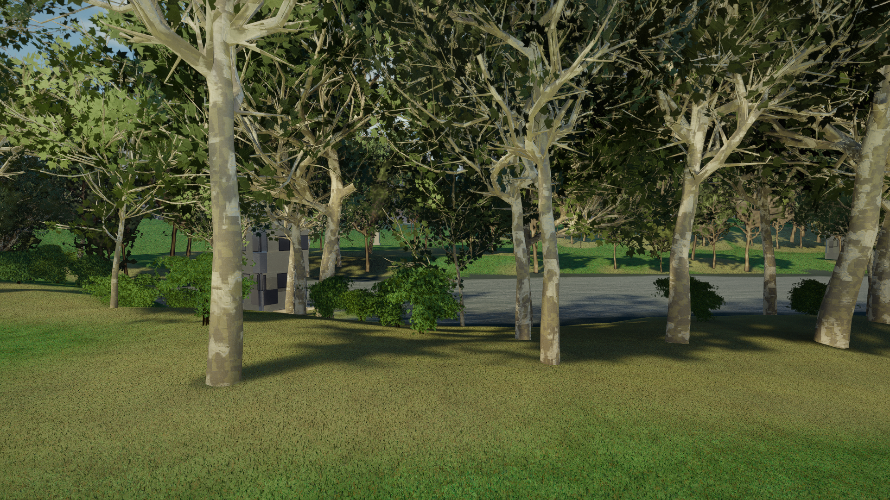

## Central Park Walk

*An AI-human collaboration to reconstruct Central Park in 3D from freely available public data.*

Central Park Walk is a real-time 3D walking simulation of all 843 acres of New York's Central Park, built entirely from freely available public data — LiDAR surveys, OpenStreetMap, the NYC Tree Census, building footprints — and interpreted by Claude (Anthropic). No objectives, no score. Just a place.

Every tree has a real measured height. Every path follows its real-world geometry. Every building has its actual footprint and construction year. The terrain is accurate to one foot. The data has gaps, and we leave them visible — gaps tell us what humans haven't yet measured or mapped.


*Spring dawn at Cherry Hill. Golden light through the canopy with sun sparkle on the Lake. Data-driven tree heights from LiDAR, species-specific leaf cards.*


*Walking through the Ramble at noon. Crossed-quad leaf cards on 15 species, FBM bark with 3D normal relief, hexaquo grass at 600 blades/m².*


*The Great Lawn under snow. Full day/night cycle, 4 seasons, 5 weather modes. Building silhouettes from 6,557 NYC footprints + LiDAR heights.*


*Morning fog in the North Woods. Volumetric atmosphere, 9,852 trees from census + OSM + woodland scatter, terrain from 1ft LiDAR DEM.*

## Quick Start

### Prerequisites
- [Godot 4.6.1](https://godotengine.org/download) (Linux x86_64)
- Python 3 with: `numpy`, `scipy`, `gdal`, `Pillow`
- [Blender 4.5 LTS](https://www.blender.org/download/lts/4-5/) (for model regeneration; `blender4` symlink)
- [Mtree addon v5.5](https://extensions.blender.org/add-ons/modular-tree/) (Blender extension for tree generation)
- NVIDIA GPU recommended (Forward+ renderer)

### Setup

```bash
# 1. Clone the repository
git clone https://github.com/central-park-walk/central-park-walk.git
cd central-park-walk

# 2. Download OSM data
python3 download_osm.py

# 3. Download textures, models, and sounds
python3 download_assets.py
python3 download_models.py
python3 download_sounds.py

# 4. Convert data to Godot format
python3 convert_to_godot.py

# 5. Run
/path/to/Godot_v4.6.1-stable_linux.x86_64 --path .
```

### Controls

| Input | Action |
|-------|--------|
| WASD | Walk |
| Mouse + RMB | Look around |
| Scroll / +/- | Adjust speed (Stroll / Walk / Jog / Bike / Drive / Fly) |
| T | Cycle time speed (1x / 10x / 100x / Paused) |
| [ / ] | Nudge time ±1 hour |
| P | Cycle weather (Clear / Rain / Thunderstorm / Snow / Fog) |
| N / Shift+N | Cycle month (March → April → ... → February) |
| , / . | Adjust brightness |
| 9 / 0 | Adjust wind |
| G | Toggle data gap markers |
| H | Toggle HUD |
| M | Toggle audio mute |
| F11 | Toggle fullscreen |
| F12 | Screenshot |

**Gamepad**: Left stick walk, right stick look, right trigger fly, left trigger screenshot. D-pad up/down adjust speed, D-pad left/right ±1 hour. LB cycles weather, RB cycles month.

### CLI Options

```bash
-- --tour              # Automated screenshot tour (340 shots → /tmp/tour/)
-- --tour-showcase     # Curated showcase (22 shots — ground + aerial views)
-- --readme-shots      # Regenerate the 4 README screenshots → screenshots/
-- --pos "x,z,yaw"    # Spawn at specific coordinates
-- --time noon         # Set time (dawn/morning/noon/golden_hour/dusk/night)
-- --weather rain      # Set weather (clear/rain/snow/fog)
-- --season autumn     # Set season (spring/summer/autumn/fall/winter)
```

## What's In It

| Feature | Count | Source |
|---------|-------|--------|
| Terrain | 8192×8192 mesh (14M verts) | LiDAR DEM bare earth 2017 (1ft resolution, 0.61m cells). Terrain mesh holes at terrain-integrated structures (Bethesda Terrace). 3D path mesh strips (2,624 paths). Granite curb faces (316K verts). 1,909 retaining wall segments. Rock outcrops via DSM blend (161K cells). Dappled canopy shade from tree census crown data |
| Trees | 9,852 | NYC Tree Census + OSM + woodland scatter in 12 ecological zones. **Mtree procedural generation** (Blender 4.5 + Modular Tree v5.5): 15 species × 3 size tiers (small/medium/large) = 46 GLBs with scale-aware branch density. Trees generated at real-world heights with natural branching, normalized to 5m model space. **Data-driven heights**: LiDAR 6M Trees (4,005), canopy height model enrichment (1,450), DBH-estimated (4,397). Crossed-quad leaf cards at branch tips (radius attribute). Per-pixel color noise. Cherry/callery pear/magnolia spring bloom. FBM bark with 3D normal relief. Invasive vines: porcelain berry + oriental bittersweet (13 mesh variants) |
| Vegetation | 30 undergrowth + 6 ground cover | **Undergrowth**: 5 shrubs, 8 herbs, 2 ferns, 1 wetland, 2 fungi, 12 tier-3 species. Zone-specific: NorthWoods fern-dominated, Ramble shrub-diverse, Waterside cattail/iris, WildMeadow tall herbs. **14 species with bloom-season flowers** (cardinal flower scarlet, ironweed purple, coneflower gold, etc.). **Ground cover patches**: 6 types (bramble, fern cluster, mixed weeds, tall grass, fallen leaves, twig litter) × 4 variants via shared atlas texture. Seasonal fallen leaves (October–March). Chunk-based MultiMesh with alpha-hash LOD |
| Grass & Flowers | Hexaquo method | Individual blade geometry at 600/m² via MultiMesh. 4 blade meshes, 10 zone-specific color palettes. 8 wildflower models with seasonal clustering on all lawn zones (4% maintained lawns, 10% default, 15% wild meadow). Per-pixel color noise on every blade. Wind, canopy shade, path-edge wear, seasonal color, winter dormancy |
| Water | 23 bodies + 10 streams | OpenStreetMap polygons. Canopy shade on water. Stone coping on formal water bodies. Dawn/dusk mist (8 fog volumes) |
| Buildings | 6,557 | NYC Building Footprints + LiDAR heights. 5 facade materials with per-building variation, floor-accurate windows, cornice bands, awnings, grime weathering |
| Bridges & Arches | 17 models | Custom Blender models: Bow Bridge (cast iron), Gapstow (schist), Huddlestone (cyclopean boulders), Glen Span (tall gneiss), Trefoil, Oak Bridge, Eaglevale, Winterdale, plus 9 more |
| Perimeter | 4.8 km wall + 19 gates | Manhattan schist wall from boundary polygon. Paired granite pillars at each gate |
| Barriers | 364 features | Stone walls, iron fence panels, hedges, Reservoir fence (864 sections), bridle path posts (2,990) |
| Landmarks | 39 models | Bethesda Terrace, Belvedere Castle, Swedish Cottage, The Dairy, Loeb Boathouse, Delacorte Theater, Tavern on the Green, and 30+ more |
| Furniture | 2,000+ | **33 PBR-textured models** using ambientCG materials (cast iron, weathered wood, granite, concrete, bronze). Lampposts (201), benches (610), trash cans, drinking fountains (95), decorative fountains, flagpoles, park signs (80), bollards, call boxes, info kiosks, mile markers, fitness stations, balustrades. UV-mapped with normal/roughness/metalness maps |
| Statues | 106 positions | 4 photogrammetry scans + 32 named Blender GLBs |
| Sports | 147 fields | Tennis (54 nets), basketball (72 hoops), baseball (30 backstops), soccer (22 goals), handball (4 walls), 21 playgrounds |
| Seasons | 12 months | Per-species phenology, spring blossoms (cherry/magnolia/callery pear), cherry petal drift, autumn falling leaves, undergrowth bloom colors, seasonal fallen leaf litter. Monthly cycling (N key) |
| Weather | 5 modes | Clear, rain, thunderstorm, snow, fog — with surface response (wet darkening, puddles, frost, snow accumulation) |
| Day/night | Full cycle | 48-lamp pool, lit windows, NYC light pollution, moon, volumetric god rays, aerial perspective |
| Audio | 5 layers | Wind, city ambient, water proximity, surface-aware footsteps, rain |
| Post-processing | EGTTR-inspired | Soft impressionist bloom (midtone glow), color diffusion (12% neighbor blend), filmic tonemap, per-pixel noise on all natural surfaces (grass/leaves/bark/terrain), split-tone, film grain, seasonal color shifts |

## Performance

First launch builds mesh caches (~33s). Subsequent launches load cached geometry for buildings (6,557 extruded footprints), tree models (15 GLBs), furniture models, and prebaked water grids — reducing load time significantly. Caches auto-invalidate when source data changes. Delete `cache/` to force a full rebuild.

## Data Sources

All data is freely available. No paid APIs. No API keys.

| Source | What It Provides | License |
|--------|-----------------|---------|
| [NYC LiDAR (2017)](https://gis.ny.gov/elevation/lidar-coverage) | 1ft terrain elevation (DEM bare earth) | Public Domain |
| [NYC 6M Trees](https://data.cityofnewyork.us/Environment/2015-Street-Tree-Census-Tree-Data/uvpi-gqnh) | Tree positions, heights, crown areas | Public Domain |
| [OpenStreetMap](https://www.openstreetmap.org/) | Paths, water, buildings, bridges, furniture | ODbL |
| [NYC Tree Census](https://data.cityofnewyork.us/) | Species, diameter for park trees | Public Domain |
| [Sketchfab](https://sketchfab.com/) | Photogrammetry scans (3 statues + Bethesda Fountain) | CC-BY |
| Custom Blender scripts | 46 Mtree tree models (15 species × 3 tiers), 33 PBR furniture models, 30 undergrowth species, 24 ground cover patches, 17 bridges, 13 vine models | Original (MIT) |
| [ambientCG](https://ambientcg.com/) / [Polyhaven](https://polyhaven.com/) | PBR textures, HDRI sky | CC0 |

## How to Contribute

This project grows with human attention.

**No coding required**: Map furniture in OSM (only ~10% of real lampposts/benches are mapped). Take photogrammetry scans of statues (4 of 106 scanned) or landmarks. Record field audio. Photograph landmarks and materials. Map rock outcrops (~170 named, 1 in OSM). Close-range drone or terrestrial LiDAR of architectural detail is especially valuable.

**Technical**: Custom Blender tree models (all species-specific). Interior spaces. Performance profiling. Cross-platform support.

See [CONTRIBUTING.md](CONTRIBUTING.md) for detailed guidelines.

## Philosophy

1. **Data-first**: Don't guess — get better data. Gaps are visible because gaps are real.
2. **Honest interpretation**: Render what data and AI perception together produce.
3. **Community-driven**: Humans contribute data, AI reinterprets it.
4. **Accessibility**: A walking simulator. No competition, no violence.

## Support the Project

Central Park Walk is built by Christopher Abbey and Claude, with no institutional backing.

[](https://opencollective.com/central-park-walk)

See [FUNDING.md](FUNDING.md) for details on how funds are used.

## Tech Stack

| Layer | Technology |
|-------|-----------|
| Engine | Godot 4.6.1 (Forward+, GDScript) |
| Data pipeline | Python (GDAL, numpy/scipy, Pillow) |
| 3D modeling | Blender 4.5.8 LTS + Mtree v5.5 (procedural trees), ambientCG PBR textures |
| Rendering | 24 custom GLSL shaders, MultiMesh instancing, buffer-based grass (600/m²), 8K prebaked terrain mesh, shared texture atlases (leaf + ground cover), per-pixel hash noise on all natural surfaces |

## License

Code: [MIT License](LICENSE)
Assets and creative content: [CC-BY-SA 4.0](https://creativecommons.org/licenses/by-sa/4.0/)

## Credits

- **Christopher Abbey** — Project creator, technical lead
- **Claude (Anthropic)** — Co-creator: data interpretation, code, shaders, artistic decisions

Asset sources: [credits.txt](credits.txt)

Map data © [OpenStreetMap](https://www.openstreetmap.org/copyright) contributors. LiDAR data from NYS GIS Clearinghouse. Tree data from NYC OpenData.
